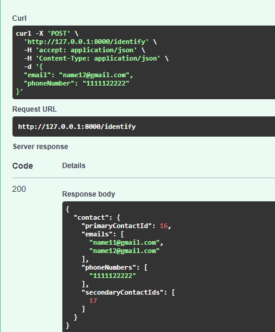

# 🔗 Bitespeed Identity Reconciliation API


A FastAPI service that consolidates customer identities across multiple purchases with different contact information. It identifies and links contacts using email and phone number combinations, handling complex identity resolution with a clean and scalable architecture.

---

## ✨ Features

- 🔁 Identity resolution across email/phone combinations  
- 🔗 Primary and secondary contact linking  
- 📡 RESTful API endpoint (`/identify`)  
- 🐘 PostgreSQL database integration  
- ☁️ Render.com deployment ready  

---

## 📮 API Endpoint

### `POST /identify`

Consolidates contact information and returns linked identities.

**Request:**

```json
{
  "email": "string|null",
  "phoneNumber": "string|null"
}
```

**Response:**

```json
{
  "contact": {
    "primaryContactId": 1,
    "emails": ["primary@example.com", "secondary@example.com"],
    "phoneNumbers": ["1234567890", "9876543210"],
    "secondaryContactIds": [2, 3]
  }
}
```

---

## 🧪 Test Cases

### 1. New Email + New Phone Number  
✅ Creates a new primary contact record  
(https://image1.png)

### 2. Same Email + New Phone Number  
✅ Creates a secondary contact linked to the existing email  
(https://image2.png)

### 3. New Email + Same Phone Number  
✅ Creates a secondary contact linked to the existing phone  
(https://image3.png)

### 4. Email from User A + Phone from User B  
✅ Links two previously separate identities and converts the newer primary to secondary  
(https://image4.png)

---

## ⚙️ Local Setup

### Prerequisites

- Python 3.9+
- PostgreSQL 12+
- Render.com account (for deployment)

---

### Installation

1. **Clone the repository:**

```bash
git clone https://github.com/yourusername/bitespeed-api.git
cd bitespeed-api
```

2. **Create a virtual environment:**

```bash
python -m venv venv
source venv/bin/activate        # For Linux/Mac
venv\Scripts\activate           # For Windows
```

3. **Install dependencies:**

```bash
pip install -r requirements.txt
```

4. **Set up environment variables:**

```bash
cp .env.example .env
# Then edit .env with your PostgreSQL credentials
```

---

### Run Migrations

```bash
alembic upgrade head
```

---

### Start the Server

```bash
uvicorn app.main:app --reload
```

Visit: [http://localhost:8000/docs](http://localhost:8000/docs) for Swagger UI.

---

## ☁️ Deploying to Render

1. Push your project to GitHub.
2. Create a new **Web Service** on [Render](https://render.com/).
3. Use the following:

- **Build Command**:
  ```bash
  pip install -r requirements.txt && alembic upgrade head
  ```
- **Start Command**:
  ```bash
  uvicorn app.main:app --host 0.0.0.0 --port 10000
  ```

4. Add all environment variables from `.env` into Render dashboard.
5. Done! 🎉

---
speed.com)

> Built with ❤️ using FastAPI & PostgreSQL
